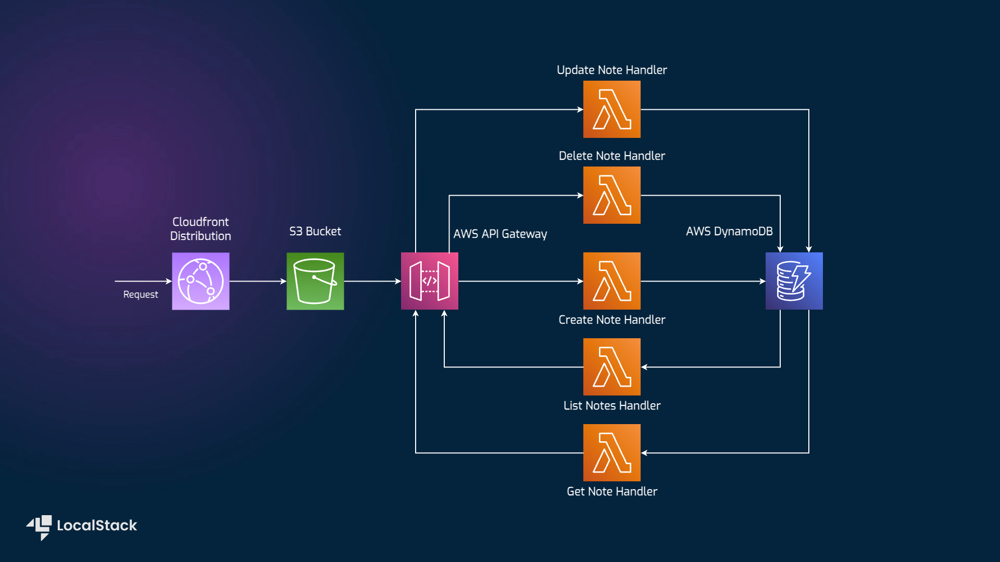
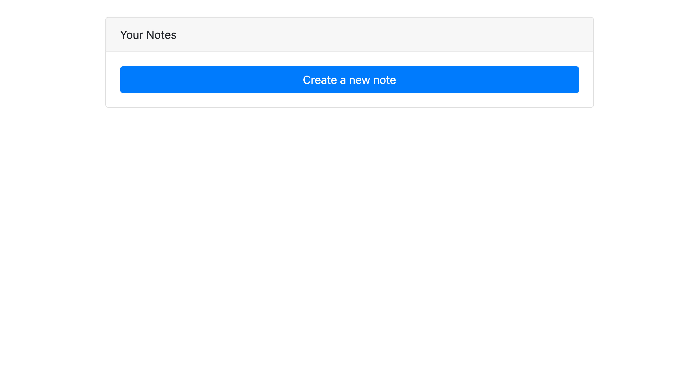
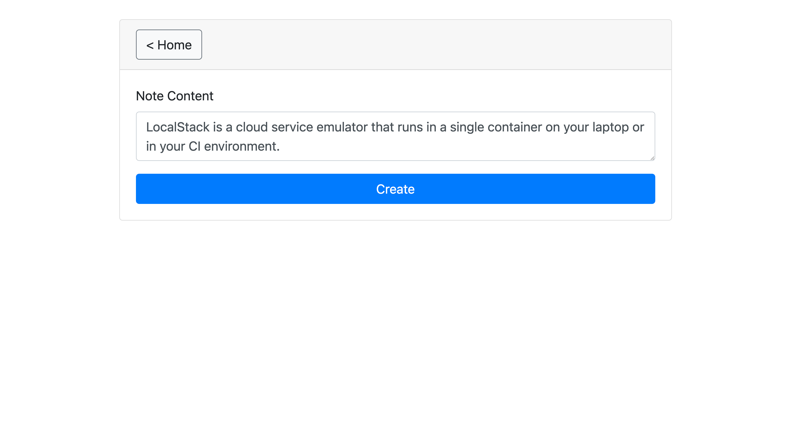
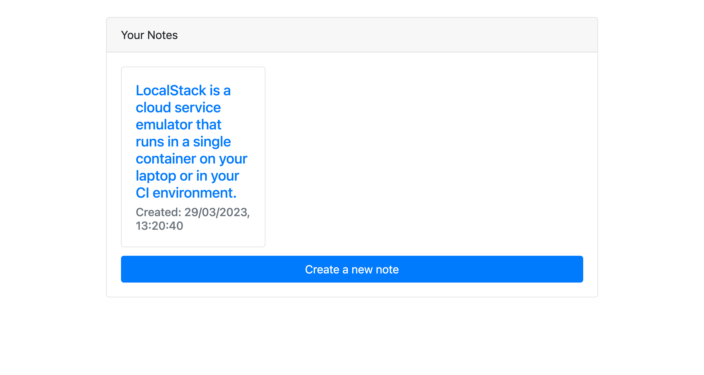

# Note-Taking application using AWS SDK for JavaScript, Amazon DynamoDB, Lambda, Cognito, API Gateway, S3, Cloudfront

| Key          | Value                                                                                                                                                                                                                                                                                                                                                                                                                                                                                                                                                                                                                                                                                                                                                                                                                                                                                                                                                                                                                                                                                                                                                                                                                                                                                                                                                                          |
| ------------ | ------------------------------------------------------------------------------------------------------------------------------------------------------------------------------------------------------------------------------------------------------------------------------------------------------------------------------------------------------------------------------------------------------------------------------------------------------------------------------------------------------------------------------------------------------------------------------------------------------------------------------------------------------------------------------------------------------------------------------------------------------------------------------------------------------------------------------------------------------------------------------------------------------------------------------------------------------------------------------------------------------------------------------------------------------------------------------------------------------------------------------------------------------------------------------------------------------------------------------------------------------------------------------------------------------------------------------------------------------------------------------ |
| Environment  |   |
| Services     | DynamoDB, Lambda, Cognito, API Gateway, S3, IAM, Cloudfront                                                                                                                                                                                                                                                                                                                                                                                                                                                                                                                                                                                                                                                                                                                                                                                                                                                                                                                                                                                                                                                                                                                                                                                                                                                                                                                    |
| Integrations | CDK, AWS SDK for JavaScript                                                                                                                                                                                                                                                                                                                                                                                                                                                                                                                                                                                                                                                                                                                                                                                                                                                                                                                                                                                                                                                                                                                                                                                                                                                                                                                                                    |
| Categories   | Serverless;                                                                                                                                                                                                                                                                                                                                                                                                                                                                                                                                                                                                                                                                                                                                                                                                                                                                                                                                                                                                                                                                                                                                                                                                                                                                                                                                                                    |
| Level        | Beginner                                                                                                                                                                                                                                                                                                                                                                                                                                                                                                                                                                                                                                                                                                                                                                                                                                                                                                                                                                                                                                                                                                                                                                                                                                                                                                                                                                       |
| GitHub       | [Repository link](https://github.com/localstack/aws-sdk-js-notes-app)                                                                                                                                                                                                                                                                                                                                                                                                                                                                                                                                                                                                                                                                                                                                                                                                                                                                                                                                                                                                                                                                                                                                                                                                                                                                                                          |

## Introduction

The Note-Taking application built using AWS SDK for JavaScript (v3) demonstrates how to build a serverless web application using DynamoDB, Lambda, Cognito, API Gateway, S3 and Cloudfront. This sample application deploys five Lambda functions to create, list, update, delete, and get all the notes. A React-based frontend served via a Cloudfront distribution and an S3 bucket allows the user to interact with the Lambda functions exposed via an API Gateway URL. Users can deploy this application sample on LocalStack & AWS using AWS Cloud Development Kit with no changes. To test this application sample, we will demonstrate how you use LocalStack to deploy the infrastructure on your developer machine and your CI environment. Furthermore, we will showcase how you can interact with the web user interface to verify the application's functionality.

## Architecture diagram

The following diagram shows the architecture that this sample application builds and deploys:



We are using the following AWS services and their features to build our infrastructure:

- [DynamoDB](https://docs.localstack.cloud/user-guide/aws/dynamodb/) as a key-value & document database to perform create, delete, get, list and update operations on the user notes.
- [S3](https://docs.localstack.cloud/user-guide/aws/s3/) to perform `PUT`, `GET`, `DELETE` operations using a browser client, and deploy the web application on a locally accessible S3 URL.
- [Lambda](https://docs.localstack.cloud/user-guide/aws/lambda/) to create the serverless functions to create, list, update, delete, and get all the user notes.
- [IAM](https://docs.localstack.cloud/user-guide/aws/iam/) to create policies to specify roles and permissions for various AWS services.
- [API Gateway](https://docs.localstack.cloud/user-guide/aws/apigatewayv2/) to expose the Lambda functions to the user through HTTP APIs.
- [Cognito User Pools](https://docs.localstack.cloud/user-guide/aws/cognito/) for creating an identity pool to generate signed url for S3.
- [Cloudfront](https://docs.localstack.cloud/user-guide/aws/cloudfront/) to serve frontend content.
- [S3](https://docs.localstack.cloud/user-guide/aws/s3/) to store files for the frontend build.

## Prerequisites

- LocalStack Pro with the [`localstack` CLI](https://docs.localstack.cloud/getting-started/installation/#localstack-cli).
- [AWS CLI](https://docs.localstack.cloud/user-guide/integrations/aws-cli/) with the [`awslocal` wrapper](https://docs.localstack.cloud/user-guide/integrations/aws-cli/#localstack-aws-cli-awslocal).
- [CDK](https://docs.localstack.cloud/user-guide/integrations/aws-cdk/) with the [`cdklocal`](https://www.npmjs.com/package/aws-cdk-local) wrapper.
- [Node.js](https://nodejs.org/en/download/) with `yarn` package manager.

Start LocalStack Pro with the `LOCALSTACK_AUTH_TOKEN` pre-configured:

```shell
export LOCALSTACK_AUTH_TOKEN=<your-auth-token>
EXTRA_CORS_ALLOWED_ORIGINS=* localstack start
```

The `EXTRA_CORS_ALLOWED_ORIGINS` configuration variable allows our website to send requests to the HTTP APIs exposed via the API Gateway. If you prefer running LocalStack in detached mode, you can add the `-d` flag to the `localstack start` command, and use Docker Desktop to view the logs.

## Instructions

You can build and deploy the sample application on LocalStack by running our `Makefile` commands: `build`, `bootstrap`, and `deploy`. Alternatively, here are instructions to deploy it manually step-by-step.

### Installing dependencies

To install the dependencies, run the following command:

```shell
yarn install
```

### Building the Lambda functions

To build the Lambda functions, run the following command:

```shell
make build
```

You are expected to see the following output:

```shell
  dist/updateNote/app.js  186.5kb
  dist/createNote/app.js  186.1kb
  dist/deleteNote/app.js  185.9kb
  dist/getNote/app.js     184.0kb
  dist/listNotes/app.js   182.5kb

⚡ Done in 75ms
```

### Bootstrapping the CDK

To bootstrap the CDK, run the following command:

```shell
make bootstrap
```

### Deploying the infrastructure

To deploy the infrastructure, run the following command:

```shell
make deploy
```

> If you see a `CREATE_FAILED (Deployment failed)` error, wait a few seconds and re-run the command.

You are expected to see the following output:

```shell
✅  aws-sdk-js-notes-app

✨  Deployment time: 10.5s

Outputs:
aws-sdk-js-notes-app.FilesBucket = aws-sdk-js-notes-app-filesbucket2b30d8e0-cd2131aa
aws-sdk-js-notes-app.GatewayUrl = https://61nfdvigog.execute-api.localhost.localstack.cloud:4566/prod/
aws-sdk-js-notes-app.IdentityPoolId = us-east-1:f3561e4c-2a11-48d5-aaa2-bdc3c5e4d8a6
aws-sdk-js-notes-app.Region = us-east-1
aws-sdk-js-notes-app.endpointEndpoint5E1E9134 = https://61nfdvigog.execute-api.localhost.localstack.cloud:4566/prod/
Stack ARN:
arn:aws:cloudformation:us-east-1:000000000000:stack/aws-sdk-js-notes-app/ebb32380

✨  Total time: 11.3s
```

### Configuring the frontend

To configure the frontend to use the deployed infrastructure, run the following command:

```shell
make prepare-frontend-local
```

It will update the `packages/frontend/.env` file with the deployed infrastructure's output values.

### Deploying the frontend

```shell
make build-frontend
make bootstrap-frontend
make deploy-frontend
```

### View the frontend

To start the frontend locally, run the following command:

```shell
yarn start:frontend
```

You'll see the URL to access the frontend in the output of the `yarn start:frontend` command

### Testing the web application

To test the web application, open the URL above. You will see the following page:



To create a new note, click on the **Create a new note** button. You will see the following page:



You can click on **Create** and see the note added to the list of notes:



You can further edit, delete, and view the notes.

### GitHub Action

This application sample hosts an example GitHub Action workflow that starts up LocalStack, builds the Lambda functions, and deploys the infrastructure on the runner. You can find the workflow in the `.github/workflows/main.yml` file. To run the workflow, you can fork this repository and push a commit to the `main` branch.

Users can adapt this example workflow to run in their own CI environment. LocalStack supports various CI environments, including GitHub Actions, CircleCI, Jenkins, Travis CI, and more. You can find more information about the CI integration in the [LocalStack documentation](https://docs.localstack.cloud/user-guide/ci/).

### Preview environment

This sample further shows off our preview environments feature. Preview environments allow you to deploy your application to a separate environment whenever you want with the right configuration. You can find the workflow in the `.github/workflows/preview.yml` file. You can find more information about preview environments in the [LocalStack documentation](https://docs.localstack.cloud/user-guide/cloud-sandbox/application-previews/).

## Learn more

The sample application is based on a public [AWS sample app](https://github.com/aws-samples/ecs-apigateway-sample) and a [SST tutorial](https://github.com/serverless-stack/demo-notes-app).

## Contributing

We appreciate your interest in contributing to our project and are always looking for new ways to improve the developer experience. We welcome feedback, bug reports, and even feature ideas from the community.
Please refer to the [contributing file](CONTRIBUTING.md) for more details on how to get started.
